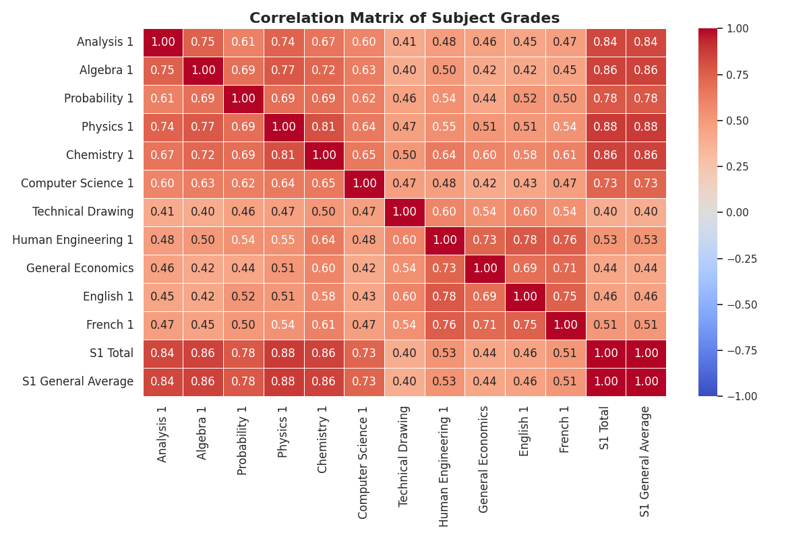
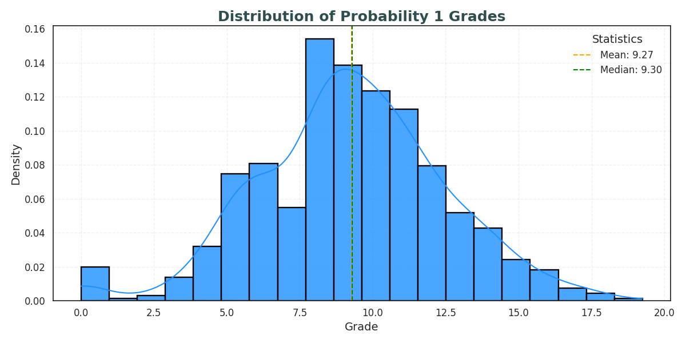
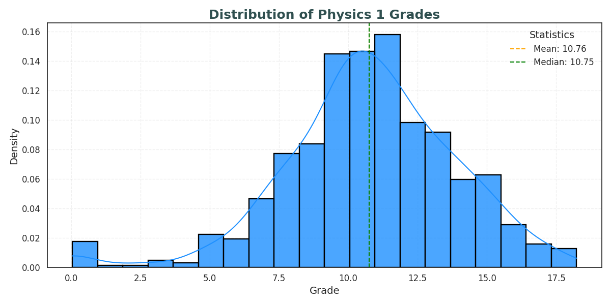

# S1_Data_Analysis
# Student Performance Data Analysis

## Project Overview

This small project analyzes the academic performance of first-year enp students. The dataset includes grades for several subjects and aims to identify trends, correlations, and provide valuable insights to improve the students' academic outcomes.

Data was given in pdf format, therefore it was necessary to convert it to a format that python modules can read and execute on(csv)...During this process there was data loss, I minimized its impact by replacing the empty values with the mean calculated from available values. though, the data loss wasn't huge compared to the available data size.

### Objective:
- Analyze student performance data.
- Identify correlations between different subjects and the overall performance.
- Visualize and interpret these relationships to improve educational strategies.

---

## Data Description

The dataset contains student marks for the following subjects:

1. **Analysis 1**  
2. **Algebra 1**  
3. **Probability 1**  
4. **Physics 1**  
5. **Chemistry 1**  
6. **Informatics 1**  
7. **Technical Drawing**  
8. **Human Engineering 1**  
9. **General Economics**  
10. **English 1**  
11. **French 1**  
12. **Total S1** (Total score for Semester 1)  
13. **M.G. S1** (Mastery Grade for Semester 1)

---

## Data Preprocessing

1. **Data Cleaning**:
   - Missing values were handled by filling them with the mean value of each respective subject.
   - Numerical columns were normalized by dividing values by 100.
   
2. **Column Renaming**: 
   - French subject names were translated into English for consistency.
   
3. **Outliers Removal**: 
   - Extreme outliers were removed based on certain predefined criteria.

---

## Analysis & Visualizations

### 1. Descriptive Statistics
Descriptive statistics were calculated for each subject, including:
- **Mean**: Average performance in each subject.
- **Standard Deviation**: Spread of the marks for each subject.
- **Min/Max**: Minimum and maximum scores for each subject.

### 2. Correlation Matrix
The correlation matrix was computed using the Pearson correlation coefficient to identify relationships between subjects. The correlation values range from -1 (perfect negative correlation) to +1 (perfect positive correlation), with values closer to 0 indicating weak or no correlation.

### 3. Correlation Heatmap
A heatmap was generated to visually represent the correlation matrix. Strong correlations are represented by darker colors, while weak correlations are lighter.

### 4. Distribution of Marks  
Histograms were plotted for each subject to show the distribution of student marks. These visualizations help us understand the frequency of certain ranges of grades and identify trends in student performance.

- **Analysis 1 Distribution:**

- **Algebra 1 Distribution:**

- **Probability 1 Distribution:**

- **Physics 1 Distribution:**

- **Chemistry 1 Distribution:**

- **Computer Science 1 Distribution:**

- **Technical Drawing Distribution:**

- **Human Engineering 1 Distribution:**

- **General Economics Distribution:**

- **English 1 Distribution:**

- **French 1 Distribution:**

- **S1 Total Distribution:**

- **S1 General Average Distribution:**

---

# Interpretation of Subject Correlation Matrix

## 1. Strongest Subject Correlations
- **Analysis 1 and Algebra 1 (0.75):**  
  This high correlation suggests that students who perform well in Analysis 1 tend to perform well in Algebra 1. This is expected since both subjects involve mathematical reasoning and problem-solving.  

- **Physics 1 and Chemistry 1 (0.81):**  
  A strong relationship here indicates that students who excel in one science subject tend to do well in the other. This could be due to overlapping concepts, such as atomic structure and quantum physics.  

- **Algebra 1 and Physics 1 (0.77):**  
  Algebra is essential for solving physics problems, explaining why strong algebra skills correlate with better performance in Physics 1.  

## 2. Subjects with Moderate Correlations
- **Probability 1 with Analysis 1 (0.61) and Algebra 1 (0.69):**  
  Since probability involves mathematical concepts like combinatorics and statistics, its link with core math subjects is reasonable.  

- **Computer Science 1 with other subjects (~0.6 range):**  
  The subject has a moderate correlation with math and science-related subjects (e.g., Analysis 1: 0.60, Physics 1: 0.64). This indicates that logical and analytical skills play a role in both computing and STEM subjects.  

- **English 1 and French 1 (0.75):**  
  A strong correlation between language subjects suggests that students good at one language are likely proficient in the other, possibly due to similar learning strategies.  

## 3. Subjects with Weaker Correlations
- **Technical Drawing (~0.4 range with most subjects):**  
  It has lower correlations with Analysis 1 (0.41), Algebra 1 (0.40), and Physics 1 (0.47). This suggests that performance in technical drawing is less dependent on traditional STEM subjects.  

## 4. Relationship with S1 General Average
- **Strongest Correlations:**  
  - **Physics 1 (0.88), Algebra 1 (0.86), Chemistry 1 (0.86), and Analysis 1 (0.84):**  
    These subjects are strongly correlated with the **S1 General Average**, indicating their significant weight in overall academic performance.  
  - **Probability 1 (0.78) and Computer Science 1 (0.73):**  
    Also contribute notably to overall performance.  

- **Weaker Correlations:**  
  - **Technical Drawing (0.40) and General Economics (0.44):**  
    These subjects have the lowest correlation with the **S1 General Average**, suggesting they might be less influential in determining overall academic performance.  

## Conclusion
- Core subjects like **Physics, Algebra, Chemistry, and Analysis** play a crucial role in overall academic success.  
- **Language subjects (English, French) are strongly linked,** indicating shared learning skills.  
- **Technical Drawing and General Economics** seem to be more independent from the other subjects and overall performance.  
- Physics tends to be the most linearly correlated subject with the S1 average which highlights the fact that students with high understanding of physics can perform better in general
This analysis helps identify key subjects that impact academic success and could guide study prioritization.

